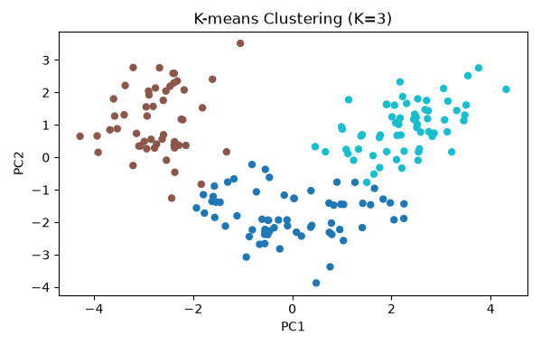

[1장 2강] 실습: 핵심 모델과 선택 기준 압축 정리

# 필수 1. 세 가지 분류 모델을 같은 조건에서 비교하기

## ▶ 문제 1-1: validation 모델 비교와 동률 처리

### 업무 요청

세 후보 모델 중 하나를 후속 실험에 사용할 모델 family로 정해야 합니다. 모델마다 다른 split을 사용하면 표본 차이와 모델 차이를 구분할 수 없으므로 같은 train과 validation을 사용하세요. 악성 탐지가 목적이므로 AP를 첫 기준으로 사용하고 동률 규칙까지 명시하세요.

### 수행해야 할 작업

1. Logistic Regression과 KNN에 `StandardScaler`를 포함하세요.
2. Decision Tree는 원래 특성 단위로 학습하세요.
3. 세 모델의 validation AP·F1·Recall을 계산하세요.
4. AP, F1, Recall 내림차순과 고정 우선순위 오름차순으로 정렬하세요.
5. 코드로 계산한 선택 결과와 같은 규칙의 `max()` 결과가 일치하는지 확인하세요.
6. 선택 모델의 장점과 이 데이터에서만 유효한 결과라는 한계를 작성하세요.

### 시작 코드

```python
def compare_classifiers(models, X_train, y_train, X_valid, y_valid):
    """세 분류 후보의 validation 표와 선택 모델 이름을 반환합니다."""
    # 모든 후보는 동일한 train·validation 행과 악성=1 정의를 공유해야 합니다.
    # AP 동률을 임의로 깨지 말고 F1·Recall·고정 우선순위까지 명시적으로 적용하세요.
    # TODO 1: 같은 validation에서 AP·F1·Recall을 계산하세요.
    # TODO 2: 동률 처리 규칙을 적용하세요.
    raise NotImplementedError("TODO: 분류 모델 비교를 완성하세요.")
```

### 제출해야 할 결과

```
model | AP | F1 | Recall | priority

[모델 선택 보고]
- 1차 지표:
- 동률 처리 순서:
- 선택 모델:
- 선택 이유:
- 이 결과를 다른 데이터에 그대로 일반화할 수 없는 이유:
```

### 자주 하는 실수

- 모델마다 다른 train·validation split을 사용하지 마세요.
- KNN에서 scaling을 빼면 값의 단위가 큰 특성이 거리를 지배할 수 있습니다.
- AP 동률인데 DataFrame의 현재 행 순서만 믿고 모델을 고르지 마세요.


- 💡 힌트 보기
    - KNN의 거리는 특성 단위에 민감하므로 Pipeline 안에서 scaling하세요.
    - AP가 같으면 F1, Recall을 차례로 비교하세요.
    - `kind="mergesort"`를 사용하면 완전 동률에서 입력 순서도 안정적으로 유지됩니다.

```bash
Cancer split: 341 114 114
Cancer positive rate: 0.3726
Wine shape: (178, 13)

================ [Problem 1-1: Classifier Comparison & Selection] ================
   model    AP     F1  Recall  priority
logistic 1.000 0.9639  0.9302         0
     knn 1.000 0.9250  0.8605         1
    tree 0.906 0.9268  0.8837         2

[Model Selection Report]
- Primary Metric: AP (Average Precision)
- Tie-breaking Order: F1 -> Recall -> Defined Priority (Logistic:0, KNN:1, Tree:2)
- Selected Model: logistic
- Reason for Selection: Logistic Regression achieved an AP of 1.0000 alongside higher F1 and Recall compared to KNN.
- Limitation: This result is specific to the current split/dataset and should not be generalized to all classification tasks without cross-validation.
```

Logistic Regression과 KNN의 AP는 모두 1.0이지만 F1과 Recall이 더 높은 Logistic Regression이 선택됩니다. 이 관찰은 현재 분할과 설정에서의 결과이며, Logistic Regression이 모든 분류 문제에서 항상 우수하다는 뜻은 아닙니다. 같은 검증 절차에서 후보를 다시 비교해야 합니다.


# 필수 2. label 없이 Wine 군집 구조 탐색하기

## ▶ 문제 2-1: K 후보 비교와 PCA 시각화

### 업무 요청

Wine 데이터의 품종 label을 보지 않은 상태에서 화학 성분만으로 자연스러운 군집 구조가 있는지 확인해야 합니다. K를 임의로 하나 고정하지 말고 2부터 6까지 Silhouette를 비교하고, PCA 2차원 그림은 보조 자료로만 사용하세요.

### 수행해야 할 작업

1. Wine의 13개 수치 특성을 표준화하세요.
2. K=2부터 6까지 같은 seed로 K-means를 학습하세요.
3. 각 K의 Silhouette를 표로 만들고 가장 높은 K를 선택하세요.
4. PCA 2차원 좌표와 설명분산비를 계산하세요.
5. 선택 K의 군집 label로 산점도를 그리세요.
6. PCA 그림만으로 군집 품질을 확정하면 안 되는 이유를 작성하세요.

### 시작 코드

```python
def explore_wine_clusters(wine_X, k_values=range(2, 7)):
    """K별 Silhouette 표와 PCA 좌표·설명분산비를 반환합니다."""
    # wine_X는 label을 제외한 178×13 수치 특성이며 거리 계산 전에 척도를 맞춰야 합니다.
    # PCA 그림은 보조 설명용이고 K 선택은 전체 특성의 Silhouette로 수행하세요.
    # TODO 1: scaling 후 K별 Silhouette를 계산하세요.
    # TODO 2: 가장 높은 K와 PCA 2차원 좌표를 구하세요.
    raise NotImplementedError("TODO: Wine 군집 탐색을 완성하세요.")
```

### 제출해야 할 결과

```
k | silhouette
PCA explained ratio: [...]
best_k: ...

[군집 탐색 보고]
- 선택 K:
- 선택 근거:
- PC1+PC2 설명분산비:
- 그림만으로 품질을 확정할 수 없는 이유:
```
### 자주 하는 실수

- Wine 품종 label을 K-means 학습이나 K 선택에 사용하지 마세요.
- 표준화 없이 거리 기반 군집을 만들지 마세요.
- PCA 산점도가 보기 좋다는 이유만으로 K를 확정하지 마세요.


- 💡 힌트 보기
    - K-means 전에 `StandardScaler().fit_transform(wine_X)`을 사용하세요.
    - Silhouette는 1에 가까울수록 군집 내부가 응집되고 군집 사이가 분리되었음을 뜻합니다.
    - PCA 설명분산비의 합은 원본 정보 중 2차원 그림에 남은 비율입니다.

```bash
Cancer split: 341 114 114
Cancer positive rate: 0.3726
Wine shape: (178, 13)

================ [Problem 2-1: Wine Clustering Analysis (K-Means & PCA)] ================
 k  silhouette
 3      0.2849
 2      0.2593
 4      0.2586
 6      0.2372
 5      0.2315
best_k: 3
PCA explained ratio: [0.362  0.1921]


```



K=3의 Silhouette가 약 0.2849로 후보 중 가장 높습니다. 그러나 PC1과 PC2가 설명하는 분산은 합계 약 0.5541이므로 2차원 그림에는 원본 정보의 일부만 남습니다. 따라서 K 선택은 전체 13차원 Silhouette와 seed 안정성, 군집별 특성 해석을 함께 확인해야 합니다.


# 심화 1. 데이터 조건에 따라 후보 모델 추천하기

## ▶ 문제 3-1: 추천 체크리스트와 최종 선택 모델 연결

### 업무 요청

동료가 데이터 조건과 무관하게 항상 같은 세 모델을 추천하는 함수를 작성했습니다. target 유무, 문제 유형, 설명 필요성, 희소 고차원 여부가 실제 후보 목록을 바꾸도록 수정하세요. 마지막에는 문제 1에서 선택한 바로 그 모델 family를 개발 데이터 전체에 학습하고 test를 한 번 평가하세요.

### 수행해야 할 작업

1. target이 없으면 KMeans·PCA와 비지도 검증 방법을 반환하세요.
2. 분류와 회귀에 서로 다른 기본 후보를 반환하세요.
3. 설명이 필요하면 선형 모델과 얕은 트리를 앞쪽에 배치하세요.
4. 희소 고차원 입력이면 선형 계열 후보로 목록을 바꾸세요.
5. 두 조건이 추천 결과를 실제로 바꾸는지 assertion으로 확인하세요.
6. 문제 1의 `selected_template`을 train+validation에 다시 학습하고 test AP·F1을 한 번 출력하세요.

### 시작 코드

```python
def recommend_candidates(
    has_target,
    task=None,
    needs_explanation=False,
    sparse_high_dimensional=False,
):
    """데이터 조건에 맞는 후보 모델과 검증 방법을 반환합니다."""
    # target 유무와 task가 먼저 후보군을 결정하며 두 boolean 조건도 결과에 실제 영향을 줘야 합니다.
    # 이 함수는 탐색 시작점을 제안할 뿐 validation 우승 모델을 대신 선택하지 않습니다.
    # TODO 1: target과 task에 따라 기본 후보를 만드세요.
    # TODO 2: 설명 필요성과 희소 고차원 조건을 반영하세요.
    raise NotImplementedError("TODO: 후보 모델 추천 규칙을 완성하세요.")
```

### 제출해야 할 보고 형식

```
조건 | 추천 후보 3개 | 검증 방법

[후보 추천 및 최종 평가 보고]
- 기본 분류 후보:
- 설명 필요 후보:
- 희소 고차원 후보:
- validation 선택 모델:
- 최종 test AP / F1:
- 추천 목록은 시작점일 뿐인 이유:
```

### 자주 하는 실수

- 입력 인자를 함수에만 선언하고 추천 결과에는 반영하지 않는 코드를 만들지 마세요.
- 추천 함수의 모델 이름을 최종 우승 모델로 오해하지 마세요.
- validation에서 고른 모델과 다른 family를 test에 사용하지 마세요.

- 💡 힌트 보기
    - 희소 고차원 분류에는 Logistic Regression·LinearSVC·SGDClassifier 같은 선형 후보를 고려하세요.
    - `dict.fromkeys(candidates)`는 순서를 유지하면서 중복을 제거할 수 있습니다.
    - 마지막 test에는 임의의 새 모델이 아니라 `clone(selected_template)`을 사용하세요.

최종 제출 보고 양식(예시)
[모델 후보 선정 보고]
1. 세 분류 모델의 validation 비교표와 동률 처리 규칙
2. 선택 모델과 선택 근거
3. Wine K별 Silhouette, 선택 K, PCA 설명분산비
4. 기본·설명 필요·희소 고차원 조건별 후보 목록
5. 선택 모델 family의 최종 test AP·F1
6. 다음 실험에서 사용할 CV와 업무 지표

```bash
================ [Problem 3-1: Model Recommendation Checklist & Sealed Test Evaluation] ================
Default classification candidates: ['HistGradientBoostingClassifier', 'RandomForestClassifier', 'LogisticRegression']
Explainable classification candidates: ['LogisticRegression', 'DecisionTreeClassifier', 'HistGradientBoostingClassifier']
Sparse high-dimensional candidates: ['LogisticRegression', 'LinearSVC', 'SGDClassifier']

[Final Evaluation Report]
- Selected Model Family: logistic
- Final Sealed Test Metrics: {'AP': 0.9945, 'F1': 0.9630}
- Why Recommendation Checklist is Just a Starting Point: It filters model families based on constraints, but final model selection depends on validation metrics on the target data.
```

설명 필요성과 희소 고차원 조건이 후보 목록을 실제로 바꿉니다. 이 목록은 탐색을 시작할 후보군이며 최종 선택은 같은 split 또는 CV와 미리 정한 업무 지표로 결정합니다. 문제 1에서 선택한 Logistic Regression family를 유지했으므로 모델 선택과 최종 test 모델도 일치합니다.
