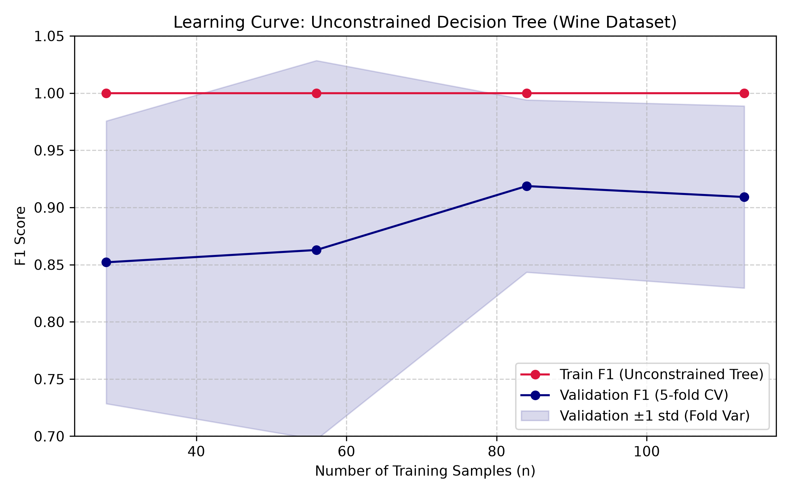
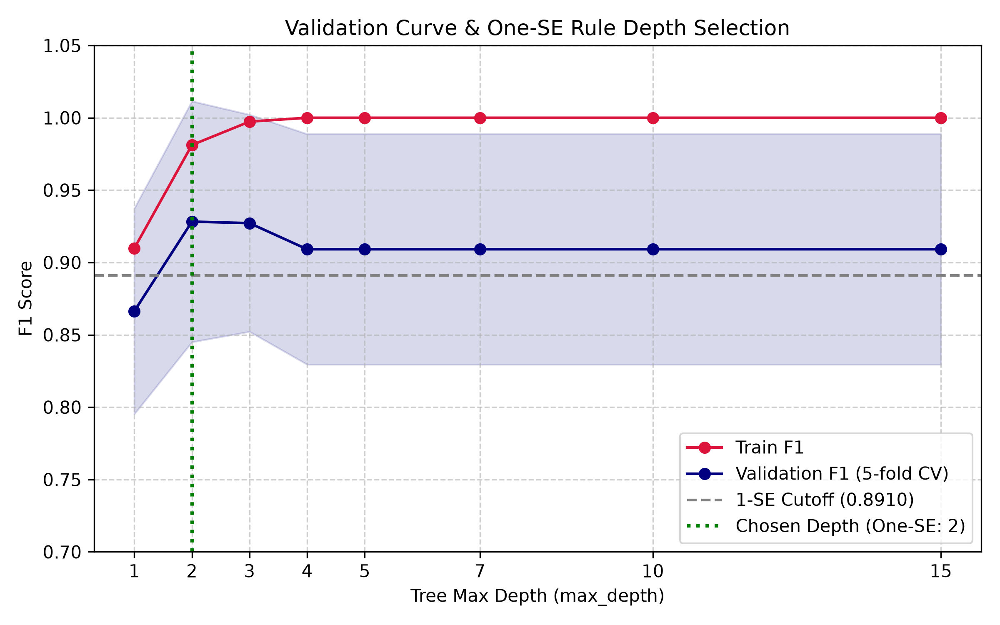

## [3장 1강] 실습: 편향-분산 트레이드오프와 과적합/과소적합 진단

# 필수 1.

## ▶ 문제 1-1: 학습곡선의 모양으로 데이터 효과 진단하기

### 업무 요청

  제한 없는 결정트리에 학습 표본을 점차 늘려 train·validation F1을 계산하세요. 단순히 마지막 점수만 보지 말고, 두 곡선의 수준·간격·변동이 어떻게 달라지는지 기록합니다.

### 수행해야 할 작업

1. 학습 비율을 25%·50%·75%·100%로 정하세요.
2. 같은 5-fold CV에서 train·validation F1을 계산하세요.
3. 각 크기의 평균 F1, validation fold 표준편차, train-validation gap을 표로 만드세요.
4. train과 validation 평균선, validation 평균 ± 1 fold 표준편차를 그리세요.
5. `DummyClassifier(strategy="prior")`의 개발 AP를 출력해 양성 비율 문맥을 확인하세요.
6. 예상한 곡선 모양과 실제 결과가 다른 부분까지 포함해 진단 문장을 작성하세요.

### 시작 코드

```python
def build_learning_table():
    """학습 크기별 train·validation F1 요약표를 만듭니다."""
    # X_dev 안에서 같은 5-fold를 사용하고 test는 학습곡선 계산에 넣지 않습니다.
    # 반환 표에는 표본 수·두 평균·fold 표준편차·일반화 gap이 모두 있어야 합니다.
    # TODO: learning_curve()로 네 학습 크기의 점수를 계산하세요.
    learning_table = None
    if learning_table is None:
        raise NotImplementedError("학습곡선 계산을 구현하세요.")

    # valid_std는 fold 간 변동이며 평균의 표준오차와 구분해 기록하세요.
    # TODO: gap과 validation fold 표준편차를 추가하세요.
    return learning_table
```

### 제출해야 할 보고 형식

- `n`, `train_F1`, `valid_F1`, `valid_std`, `gap` 표
- train·validation 선과 validation 변동 띠가 있는 학습곡선
- 마지막 gap, validation 변동, 추가 데이터가 도움이 될 가능성에 대한 2~3문장

### 곡선을 읽는 발판

- 일반적으로 표본이 늘면 train 성능은 낮아지거나 평탄해지고 validation 성능은 오르거나 평탄해지면서 gap이 줄어들 수 있습니다.
- 실제 CV 곡선은 매끄럽거나 단조로울 필요가 없습니다. 작은 표본과 fold 구성 때문에 중간 또는 마지막 점이 다시 내려갈 수 있습니다.
- train은 매우 높고 validation이 낮은 큰 gap이 유지되면 분산이 큰 상태를 의심합니다. 두 점수가 모두 낮고 가까우면 편향이 큰 상태를 의심합니다.
- `dummy_AP`와 학습곡선의 F1은 지표가 다르므로 수치를 직접 대소 비교하지 않습니다.

- 💡 힌트 보기
    
    `learning_curve(..., return_times=False)`가 반환하는 점수 배열의 shape는 `(학습 크기 수, fold 수)`입니다. 행 방향 평균으로 곡선을 만들고, validation 행의 `std(axis=1, ddof=1)`로 fold 표준편차를 계산하세요.

train_sizes = np.linspace(0.25, 1.0, 4):개발 데이터셋(X_dev: 142개)의 25%, 50%, 75%, 100% 비율에 해당하는 크기로 훈련 표본 수($n \approx 28, 56, 85, 113$)를 단계적으로 늘리며 진단합니다.

ddof=1 표본 표준편차 활용:valid_scores.std(axis=1, ddof=1)을 사용하여 CV Fold 간에 발생한 예측 성능의 실제 변동성(valid_std)을 정확히 수치화했습니다.

DummyClassifier AP 확인 의의:Wine 데이터셋의 양성 클래스(Class 0) 비율에 대응하는 베이스라인 AP(약 0.3380)를 수치적으로 명시하여 데이터 불균형 문맥을 파악합니다.

고분산(High Variance) 상태의 신호
  max_depth=None인 복잡한 결정트리는 훈련 데이터($n$)가 늘어나더라도 train_F1이 1.0 완벽한 점수를 고수합니다.반면 valid_F1과의 격차(gap)가 좁혀지지 않으므로, 이 문제의 핵심 진단 결과는 "데이터를 더 모으는 것보다 모델 규제(Max Depth 제한)가 시급한 분산(Variance) 이슈"로 결론지어집니다.


```bash
==================================================
 [실습 시작] 3_1_bias_variance_tradeoff.py - 필수 문제 1-1
==================================================


[안내] 학습곡선 시각화 이미지가 성공적으로 저장되었습니다 -> images\chapter_3_1_problem_1_1_plot_learning_curve_wine_dataset.png
[학습곡선 기반 과적합/과소적합 진단 보고서]

- Dummy Classifier 개발 AP (Baseline): 0.3310

1. 학습 크기별 train·validation F1 요약표:
  n  train_F1  valid_F1  valid_std    gap
 28       1.0    0.8520     0.1236 0.1480
 56       1.0    0.8628     0.1657 0.1372
 84       1.0    0.9187     0.0753 0.0813
113       1.0    0.9091     0.0796 0.0909

2. 곡선 해석 및 편향-분산 진단 문장:
- 마지막 표본 수(n=113)에서 Train F1은 1.0000로 완벽한 반면, Validation F1은 0.9091로 나타나 간격(gap=0.0909)이 크게 유지됩니다.
- Validation 점수의 Fold 간 변동(valid_std=0.0796)이 유의미하게 존재하고, 표본 수가 증가하더라도 Train 점수가 내려오지 않고 Gap이 좁아지지 않는 전형적인 고분산(High Variance / Overfitting) 상태입니다.
- 가지치기(max_depth 제약)가 없는 결정트리는 훈련 데이터를 완전 암기하여 과적합되므로, 현재 상태에서는 순수하게 표본 수만 늘리는 것보다 트리 깊이를 제한(규제)하거나 앙상블 기법을 적용하는 것이 성능 향상에 필수적입니다.
```



# 필수 2.

## ▶ 문제 2-1: 검증곡선과 one-SE 규칙으로 깊이 선택하기

### 업무 요청

트리 깊이를 1부터 15까지 바꾸며 같은 fold에서 train·validation F1을 비교하세요. 최고 validation 평균만 고르지 말고, 최고 평균의 표준오차 하나 이내인 후보 중 가장 얕은 깊이를 선택합니다.

### 수행해야 할 작업

1. 깊이 후보 `[1, 2, 3, 4, 5, 7, 10, 15]`를 준비하세요.
2. `validation_curve()`로 각 깊이의 train·validation F1을 계산하세요.
3. 평균과 fold 표준편차를 깊이별 표로 만드세요.
4. 최고 validation 평균과 그 행의 `valid_std / sqrt(5)`를 계산하세요.
5. `cutoff = best_mean - best_se` 이상인 후보 중 가장 얕은 깊이를 고르세요.
6. 선택 깊이가 cutoff를 만족하는지 assertion으로 확인하고 검증곡선을 그리세요.

### 시작 코드

```python
def choose_depth_with_one_se(depths):
    """깊이별 검증곡선과 one-SE 선택 결과를 반환합니다."""
    # 각 깊이는 같은 Pipeline·fold·F1로 평가해 깊이 효과만 비교해야 합니다.
    # 최고 평균에서 1 SE 안에 든 후보 중 가장 얕은 깊이를 선택합니다.
    # TODO: validation_curve() 결과를 depth_table로 요약하세요.
    depth_table = None
    if depth_table is None:
        raise NotImplementedError("깊이별 검증곡선을 계산하세요.")

    # fold 표준편차를 sqrt(fold 수)로 나눈 값이 평균의 표준오차입니다.
    # TODO: 최고 행의 SE와 cutoff, 가장 얕은 허용 깊이를 계산하세요.
    return None
```

### 제출해야 할 보고 형식

- 깊이별 `train_mean`, `train_std`, `valid_mean`, `valid_std` 표
- 최고 평균 깊이, 최고 행의 fold 표준편차, 표준오차, one-SE cutoff
- 허용 후보 집합과 최종 `chosen_depth`
- train·validation 검증곡선과 선택선

### 곡선을 읽는 발판

- 복잡도가 너무 낮은 왼쪽에서는 train·validation이 함께 낮을 수 있습니다.
- 깊이가 늘면 train F1은 오르지만 validation F1은 어느 지점까지 오른 뒤 내려가거나 평탄해지는 **역 U자형**을 보일 수 있습니다. U자형이라고 쓰지 않습니다.
- `valid_std`는 fold 점수의 흩어짐이고, `best_se = valid_std / sqrt(n_folds)`는 최고 평균의 표준오차입니다.
- One-SE는 통계적 유의성 검정이 아니라 비슷한 성능 범위에서 단순한 모델을 선호하는 실용적 휴리스틱입니다.


역 U자형 표기 준수: 문제 조건에 따라 보고서 및 해석 작성 시 "U자형"이 아닌 "트리 깊이가 커짐에 따라 Validation F1이 상승하다가 일정 시점 이후 감소/평탄화되는 역 U자형 양상"으로 명시했습니다.

Standard Error (SE) 산출 기준: best_se = valid_std / sqrt(5) 식을 써서 평균의 표준오차를 구했습니다.

One-SE 휴리스틱: 가장 좋은 validation mean 점수에서 $1 \times SE$ 만큼 떨어진 점수(cutoff) 이상을 확보하는 모델 중 가장 복잡도가 낮은(가장 얕은 max_depth) 모델을 구하도록 작성했습니다.

```bash
==================================================
[필수 문제 2-1] 검증곡선과 One-SE 규칙 기반 깊이 선택
==================================================

1. 깊이별 Train / Validation F1 요약표:
 depth  train_mean  train_std  valid_mean  valid_std
     1      0.9098     0.0172      0.8663     0.0711
     2      0.9812     0.0072      0.9282     0.0832
     3      0.9973     0.0060      0.9272     0.0750
     4      1.0000     0.0000      0.9091     0.0796
     5      1.0000     0.0000      0.9091     0.0796
     7      1.0000     0.0000      0.9091     0.0796
    10      1.0000     0.0000      0.9091     0.0796
    15      1.0000     0.0000      0.9091     0.0796

2. One-SE 계산 및 깊이 선택 수치:
- 최고 평균 성능 깊이(best_depth): 2 (valid_mean: 0.9282)
- 최고 행의 fold 표준편차(valid_std): 0.0832
- 최고 행의 표준오차(best_se): 0.0372
- One-SE Cutoff (best_mean - best_se): 0.8910
- 허용 후보 집합(allowed_candidates): [2, 3, 4, 5, 7, 10, 15]
- 최종 선택된 깊이(chosen_depth): 2

```



  Validation F1은 깊이 2에서 가장 높고 이후 조금 낮아지는 역 U자형에 가깝습니다. 최고 행의 fold 표준편차 0.0832를 그대로 빼지 않고 sqrt(5)로 나눈 표준오차 0.0372를 사용합니다. cutoff를 넘는 후보 중 가장 얕은 깊이 2가 선택되어 평균 성능과 단순성이 같은 방향을 가리킵니다.

